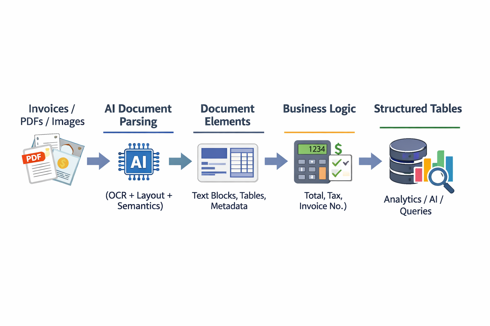

# **Databricks IDP Invoice Processing**

**An intelligent invoice parsing pipeline using Databricks AI capabilities to automatically extract structured data from raw invoice documents.**

---

## **Architecture**

**IDP Architectural Flow**



---

## **Overview**

Invoices come in all shapes, sizes, and layouts. Whether from vendors, partners, or internal systems, each document may have a unique format, making traditional rule-based parsing fragile and expensive to maintain.

This project demonstrates how to use **Databricks AI Functions (`ai_parse_document`)** together with **Apache Spark** to build a scalable Intelligent Document Processing (IDP) pipeline. The solution automatically understands invoice layouts, extracts key business information, and converts unstructured documents into structured datasets ready for analytics and reporting.

---

## **Goals**

- Accept raw invoice documents (PDFs/images) from multiple sources.
- Parse document layouts using **Databricks AI-powered document intelligence**.
- Automatically extract key invoice information, including:
  - **Invoice Number**
  - **Invoice Date**
  - **Due Date**
  - **Vendor Details**
  - **Line Items** (Description, Quantity, Unit Price, Amount)
  - **Subtotal**
  - **Tax**
  - **Total Due**
- Transform unstructured invoice documents into structured, analytics-ready tables.
- Enable scalable invoice processing using distributed Spark execution.

---

## **How It Works**

### **1. Load Raw Documents**

Invoice PDFs are stored in **Databricks Unity Catalog Volumes** and loaded as binary files while preserving their original structure.

```python
base_path = "/Volumes/workspace/gs_invoices/raw_invoices"

raw_df = (
    spark.read.format("binaryFile")
    .option("pathGlobFilter", "*.pdf")
    .load(base_path)
)
```

### **2. Parse Documents with AI**

Each invoice is processed using the **Databricks `ai_parse_document()`** function, which converts raw binary content into a structured document representation.

```python
from pyspark.sql.functions import expr

parsed_df = raw_df.select(
    "path",
    expr("ai_parse_document(content) as parsed_document")
)
```

### **3. Extract Document Elements**

The parsed document contains hierarchical information, including:

- **Text Blocks**
- **Tables and Table Cells**
- **Headers & Footers**
- **Page Metadata**
- **Bounding Boxes & Layout Information**

These nested elements are flattened using Spark transformations for downstream processing.

### **4. Structure Extraction**

Relevant invoice attributes are extracted from the parsed document and mapped into a standardized schema suitable for:

- Business Reporting
- Financial Analytics
- ERP Integration
- Data Warehousing
- Invoice Validation & Auditing

---

## **Sample Output**

| **Field** | **Example Value** |
|------------|------------------|
| **Invoice Number** | INV-30016 |
| **Invoice Date** | 2025-10-19 |
| **Due Date** | 2025-11-02 |
| **Subtotal** | $2,115.00 |
| **Tax (5.5%)** | $116.33 |
| **Total Due** | $2,314.32 |

---

## **Requirements**

- **Databricks Runtime** with AI Functions enabled
- **Unity Catalog Volumes** for document storage
- **Apache Spark (PySpark)**
- Invoice PDFs or scanned images

---

## **Getting Started**

1. Upload your invoice PDFs to a **Databricks Unity Catalog Volume**.
2. Update the `base_path` variable in the notebook to point to your invoice documents.
3. Run the **`invoice_parser.ipynb`** notebook sequentially.
4. View the extracted structured invoice data in the output Spark tables.

---

## **Project Structure**

```text
.
├── invoice_parser.ipynb
├── idp_architectural_flow.png
└── README.md
```

---

## **Files**

| **File** | **Description** |
|-----------|-----------------|
| **invoice_parser.ipynb** | Main notebook implementing the AI-powered invoice parsing pipeline. |
| **idp_architectural_flow.png** | Architecture diagram illustrating the end-to-end Intelligent Document Processing workflow. |
| **README.md** | Project documentation and setup guide. |

---

## **License**

This project is intended for **demonstration and educational purposes**.
